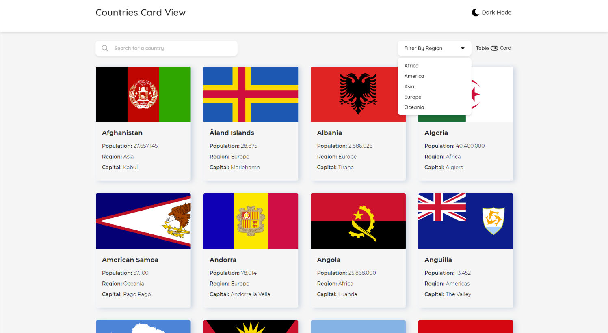
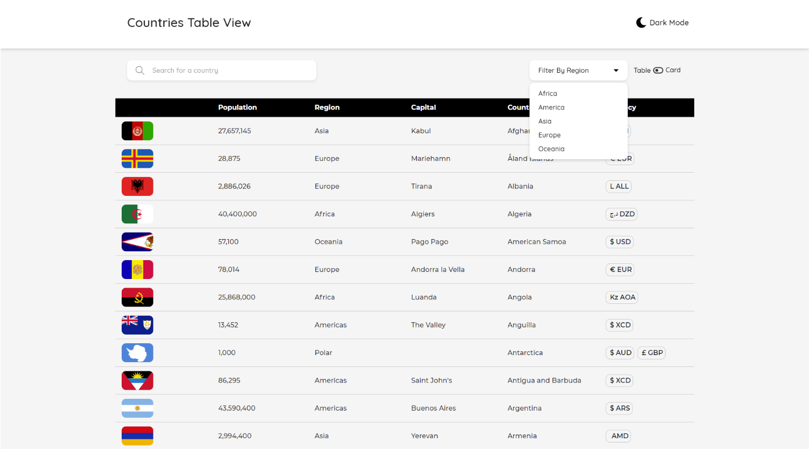

This is a frontend training test that is use to evaluate junior to mid level engineers and to train interns in their understanding of frontend technologies.

## Preview of the screens


Card View With Search and Filter



List View With Search and Filter

## Technologies Used

- ⚡️ Next.js 14 with App Router 
- ⚛️ React 18 
- 🤖 Mobx
- ✨ TypeScript 
- 💨 Tailwind CSS 3 — Configured with CSS Variables to extend the primary color 
- 📈 Absolute Import and Path Alias — Import components using @/ prefix 
- 💖 Prettier — Format your code consistently


## Getting Started

First, run the development server:

```bash
npm run dev
# or
yarn dev
# or
pnpm dev
# or
bun dev
```

Open [http://localhost:3000](http://localhost:3000) with your browser to see the result.

You can start editing the page by modifying `app/page.tsx`. The page auto-updates as you edit the file.

## What is being test here

- Are able to create components from scratch or import from a library
- Able to integrate and fetch data from an api call
- Able to write function that only does one purpose
- Able to use the DRY and KISS principle
- Understand the fundamental of routing and able to use dynamic routing ❖ Understand how flex box and grid style works
- Able to use theming
- Able to use bootstrap
- Able to create a clean folder structure
- Could write good commit messages and good documentation
- Able to use git
